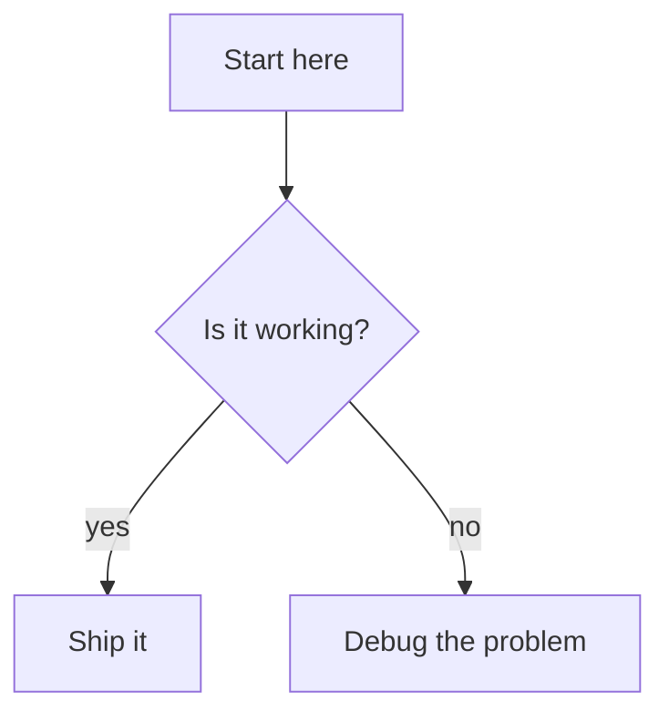
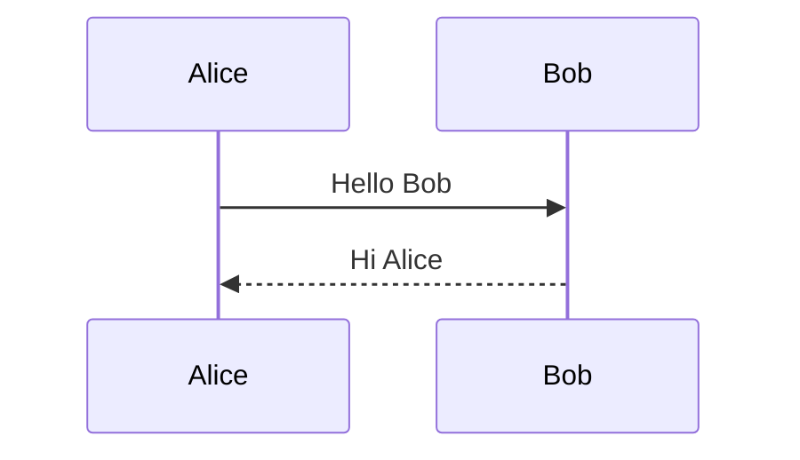

# Two diagrams

A flowchart with labels that need text measurement.

```mermaid
graph TD
  A[Start here] --> B{Is it working?}
  B -->|yes| C[Ship it]
  B -->|no| D[Debug the problem]
```

A sequence diagram.

```mermaid
sequenceDiagram
  Alice->>Bob: Hello Bob
  Bob-->>Alice: Hi Alice
```
